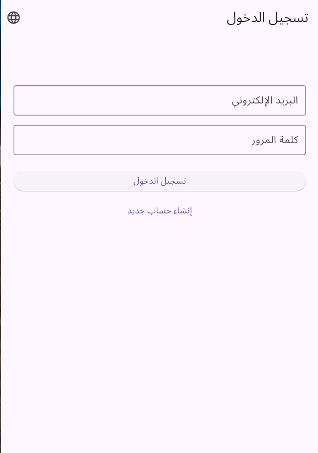
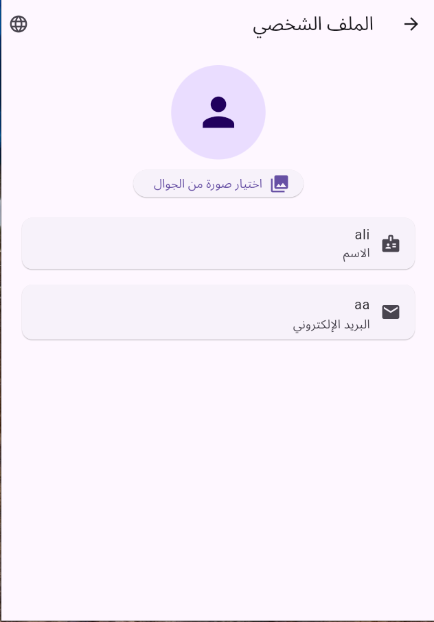
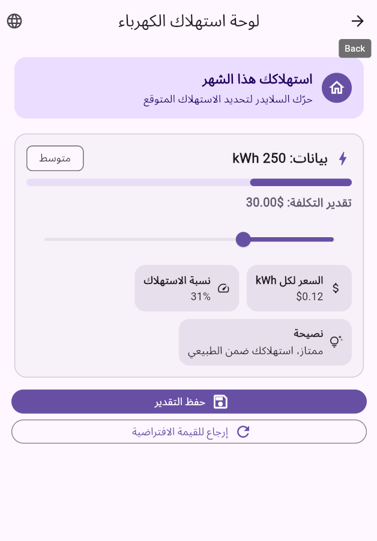
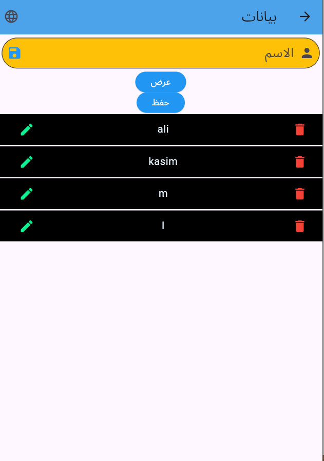

# 📱 F_APP – Flutter Application

تطبيق موبايل مطوّر باستخدام **Flutter**، يقدّم واجهة استخدام حديثة وسهلة، مع نظام تسجيل دخول، إنشاء حساب، صفحة رئيسية، وملف شخصي للمستخدم.

---

## ✨ المميزات
- تسجيل الدخول (Login)
- إنشاء حساب (Create Account)
- الصفحة الرئيسية (Home)
- الملف الشخصي (Profile)
- دعم تعدد الصفحات والتنقل
- واجهات UI منظمة
- جاهز للتطوير والتوسعة

---

## 🛠️ التقنيات المستخدمة
- Flutter
- Dart
- Material Design
- Android / iOS

---

## 📸 صور من التطبيق

### 🔐 تسجيل الدخول


### 📝 إنشاء حساب


### 🏠 الصفحة الرئيسية


### 👤 الملف الشخصي


### 📄 صفحة إضافية


### 🎓 الطلاب


---

## 🚀 تشغيل المشروع

1. تأكد من تثبيت Flutter:
```bash
flutter --version
